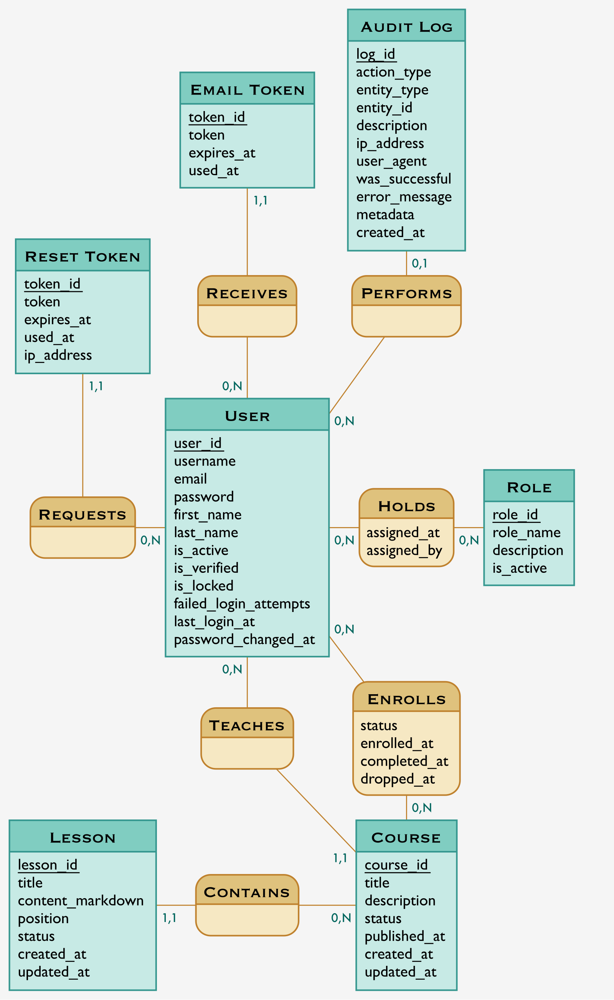
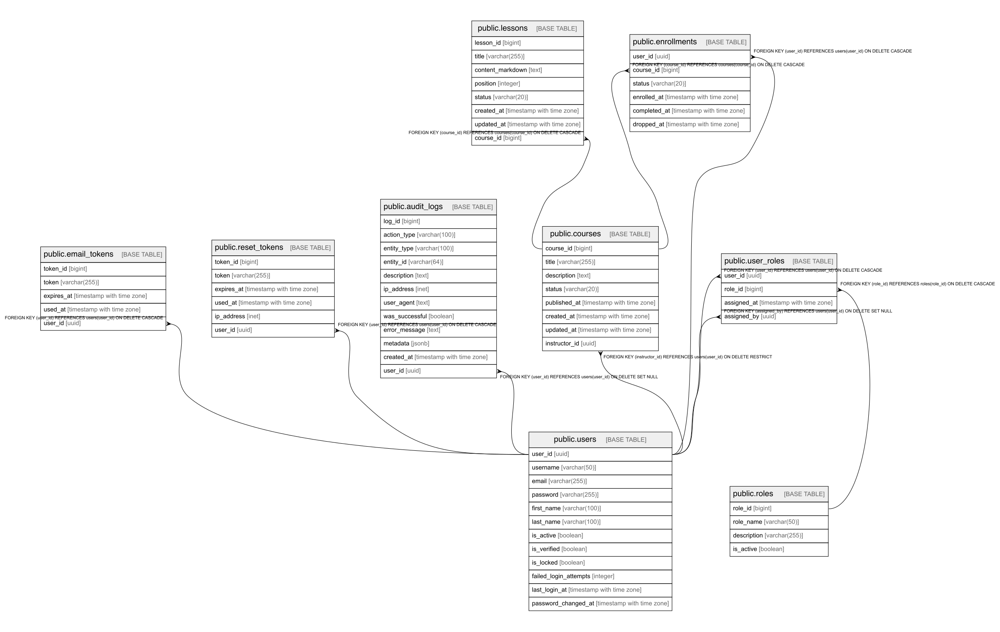
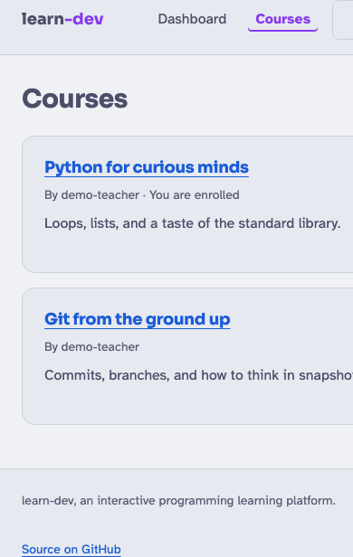
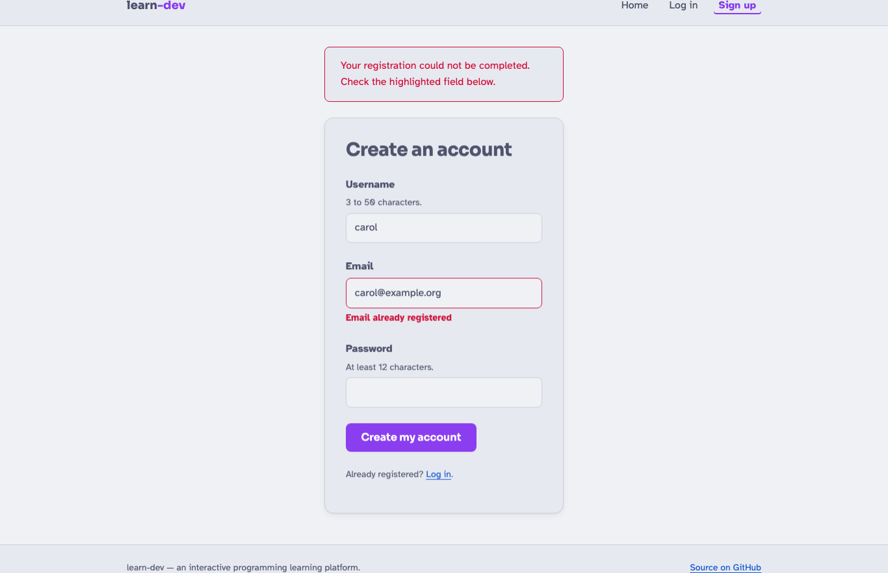

# Introduction

## Le besoin

- Apprendre à programmer suppose un **parcours structuré** : du contenu organisé, une
  progression lisible, un espace où un formateur publie et fait évoluer ses cours.
- **Problème** : offrir un environnement multi-rôles simple, **sûr** et **accessible**.
- **Solution, en une phrase** :

> *learn-dev est une plateforme web où des formateurs publient des cours composés de leçons
> en Markdown, et où des étudiants s'inscrivent et les suivent.*

::: notes
(~1 min) Me présenter. Poser le besoin : structurer l'apprentissage du code. Annoncer la
solution en une phrase. Enchaîner sur ce qu'est concrètement l'application.
:::

## learn-dev en bref

- **Trois rôles** : étudiant (`STUDENT`), formateur (`INSTRUCTOR`), administrateur (`ADMIN`).
- **Étudiant** : catalogue, inscription à un cours, lecture des leçons.
- **Formateur** : création de cours/leçons, cycle de vie de publication, gestion des inscrits.
- **Administrateur** : gestion des comptes, modération des contenus.

::: notes
(~1 min) Décrire les 3 rôles et le parcours nominal. Préciser : application web rendue côté
serveur (Spring Boot + Thymeleaf), responsive et accessible.
:::

# Conception

## Gestion de projet

- **Git par fonctionnalité** : une branche par feature, convention *Conventional Commits*.
- **Développement incrémental** : auth → domaine cours → authoring → administration.
- **14 décisions d'architecture (ADR)** tracées (format MADR).
- Principe **YAGNI** : on ne construit que le nécessaire à la v1.

::: notes
(~2 min) Insister sur la démarche d'ingénierie : branches par feature, ADR, plans versionnés.
C'est de la communication écrite (compétence transversale).
:::

## Cahier des charges & personas

- **Objectifs** : s'inscrire et suivre des cours, publier/gérer des cours, administrer.
- **Personas** :
    - **Léa** (étudiante) — suivre des cours, sur mobile comme sur ordinateur.
    - **Marc** (formateur) — rédiger en Markdown, gérer publication et inscrits.
    - **Awa** (admin) — gérer les comptes et modérer en toute sécurité.
- **Non fonctionnel** : sécurité, accessibilité RGAA, responsive, tests, CI.

::: notes
(~2 min) Dérouler les besoins par persona. Relier aux besoins non fonctionnels.
:::

## Base de données — modèle conceptuel (CP5)

::: notes
(~1,5 min) Présenter la modélisation Merise (MCD ici). 9 entités : utilisateurs, rôles,
cours, leçons, inscriptions, jetons, audit. Montrer les associations et cardinalités.
:::

## Base de données — schéma physique & choix (CP5)

- **PostgreSQL 17**, **9 tables**, migrations **Liquibase** appliquées au démarrage.
- **Clé UUID** pour les utilisateurs (anti-IDOR) ; **BIGINT** ailleurs ; clés composites.
- **Contraintes** : `UNIQUE`, `CHECK`, `FK ON DELETE CASCADE` ; Hibernate en `validate`.

::: notes
(~1,5 min) Justifier PostgreSQL (ADR-0007), Liquibase (ADR-0005), UUID (ADR-0003).
Souligner l'intégrité au plus près des données + contrôle anti-dérive de schéma en CI.
:::

## Maquettage & accessibilité (CP2)

- **Maquettes Figma** + prototypes HTML ; charte, deux thèmes (Catppuccin / Soft Paper).
- **Responsive** : versions web (bureau) **et web mobile** (points de rupture en `rem`).
- **Accessibilité RGAA / WCAG AA** : structure sémantique, *skip link*, contrastes calculés
  (min. 4,73:1), police **Atkinson Hyperlegible**.

::: notes
(~2 min) Montrer la version mobile. Insister sur l'accessibilité « par construction » et les
contrastes mesurés. C'est CP2 (maquetter) : web ET web mobile.
:::

## Environnement technique (CP1)

- **Java 21** + **Spring Boot 3.5** (Web MVC, Security, Data JPA, Validation, Mail).
- **Thymeleaf** (vues), **PostgreSQL 17** + **Liquibase**, **commonmark-java** + **jsoup**.
- **Podman / Docker Compose** (Postgres, Mongo, Mailpit) ; **Maven** ; **Git** ; **CI GitHub Actions**.
- Architecture **en couches** : Contrôleur → Service → Repository → PostgreSQL.

::: notes
(~2 min) Balayer la stack et justifier le rendu côté serveur (simplicité, sécurité, SEO).
Montrer l'outillage (conteneurs, CI). C'est CP1.
:::

# Développement

## Deux fonctionnalités CRUD

- **Feature 1 — Inscription d'un utilisateur** (validation, sécurité, jeu d'essai).
- **Feature 2 — Gestion des cours et leçons** (cycle de vie, autorisations).
- Motif commun : **Contrôleur → Service (règles métier) → Repository**, erreurs HTTP
  explicites (**403 / 404 / 409**).

::: notes
(~1 min) Annoncer les 2 features CRUD qui vont être démontrées et l'architecture commune.
:::

## Feature 1 — Inscription (CP4, CP7)

- Formulaire **validé** (Bean Validation) avec **retours d'erreur accessibles**.
- **Unicité** du nom d'utilisateur et de l'e-mail ; **hachage BCrypt** du mot de passe.
- Motif **Post-Redirect-Get** ; e-mail de vérification.

::: notes
(~2 min) Démo/écran de l'inscription. Montrer la validation et les messages d'erreur reliés
au champ (aria). CP4 (dynamique) + CP7 (composant métier).
:::

## Jeu d'essai — Inscription

| Scénario | Attendu | Obtenu |
|---|---|---|
| Cas nominal | Compte créé, mot de passe **haché**, rôle `STUDENT` | Conforme |
| E-mail déjà utilisé | Erreur de champ, **aucune** création | Conforme |
| Mot de passe trop court (< 8) | Rejet par la validation | Conforme |
| E-mail invalide | Rejet par la validation | Conforme |

::: notes
(~1,5 min) Dérouler le jeu d'essai : entrées, attendu, obtenu, écarts (aucun). Couvert par
des tests automatisés.
:::

## Feature 2 — Cours & leçons (CP7)

- **Cycle de vie** : `DRAFT → PUBLISHED → ARCHIVED` ; transitions invalides → **409**.
- **Autorisations** : le cours d'un autre formateur → **403** ; contenu invisible → **404**.
- Réordonnancement des leçons, gestion des inscrits, **journal d'audit**.

::: notes
(~2,5 min) Montrer l'espace formateur : création, publication, réordonnancement. Insister
sur les règles métier et la gestion fine des erreurs HTTP. CP7.
:::

## Front-end : interfaces & responsive (CP3, CP4)

- **21 gabarits Thymeleaf**, HTML5 sémantique, CSS responsive, fragment de mise en page partagé.
- Rendu **dynamique** du Markdown des leçons (converti puis **assaini** contre les XSS).
- Navigation précédent/suivant, affichage conditionnel selon le rôle.

::: notes
(~2 min) Montrer le catalogue. Rappeler responsive + RGAA (CP3) et la partie dynamique
serveur (CP4).
:::

## Accès aux données (CP6)

- **Spring Data JPA** : *repositories* = interfaces, requêtes **dérivées** et **paramétrées**
  (anti-injection SQL).
- **`@EntityGraph`** pour charger un utilisateur et ses rôles en une requête ; `@Transactional`.
- **NoSQL** : MongoDB **provisionné** en vue d'un stockage de contenu (non encore branché).

::: notes
(~1,5 min) Montrer un repository (interface). Assumer honnêtement l'écart NoSQL : SQL au
cœur, MongoDB prêt mais pas branché. CP6.
:::

## Sécurité

- **BCrypt** (mots de passe), **CSRF** activé, **anti-XSS** (assainissement jsoup).
- **Anti-IDOR** (UUID), **anti-énumération**, **verrouillage de compte**, **rate-limiting**.
- Jetons **hachés SHA-256**, **journal d'audit**, matrice d'autorisations testée.
- Référence **OWASP Top 10** ; veille **Semgrep**.

::: notes
(~2 min) Balayer les défenses. Relier à OWASP. C'est un point fort : sécurité par conception.
:::

## Tests

- **64 tests** (pyramide) : unitaires (Mockito), tranche JPA, intégration (MockMvc).
- **PostgreSQL réel** en test via **Testcontainers** (schéma fidèle : UUID, contraintes).
- **Couverture** mesurée par **JaCoCo**, publiée sur **Codecov** ; CI à 4 workflows.

::: notes
(~1,5 min) Montrer la stratégie de tests et la matrice de sécurité. La CI verrouille la
qualité à chaque push.
:::

# Déploiement

## Conteneurisation & CI/CD (CP8)

- **Image Docker multi-étapes** : build Maven puis exécution **non-root**.
- **Docker Compose** (Postgres / Mongo / Mailpit) ; profils **dev / prod** ; secrets via `.env`.
- **Procédure documentée** : `docker compose up -d` puis `./mvnw spring-boot:run`.
- **CI GitHub Actions** : build, tests, lint, contrôle anti-dérive de schéma.

::: notes
(~4 min) Rappeler : le déploiement en prod n'est pas exigé, c'est la QUALITÉ de la procédure
documentée qui compte. Montrer le Dockerfile et un workflow CI. CP8.
:::

# Conclusion

## Bilan des compétences

| CP | Compétence | Où |
|---|---|---|
| CP1 | Environnement de travail | Stack, Docker, CI |
| CP2 | Maquetter | Figma, RGAA, responsive |
| CP3 | Interfaces statiques | Thymeleaf, CSS, thèmes |
| CP4 | Interfaces dynamiques | Formulaires, PRG, Markdown |
| CP5 | Base de données | Merise, PostgreSQL, Liquibase |
| CP6 | Accès aux données | Spring Data JPA (+ Mongo) |
| CP7 | Composants métier | Services, règles, erreurs HTTP |
| CP8 | Déploiement | Docker, Compose, CI/CD |

::: notes
(~1,5 min) Récapituler : les 8 compétences sont couvertes. Rappeler que le jury évalue des
compétences, pas des fonctionnalités.
:::

## Difficultés & évolutions

- **Difficultés** : concurrence à l'inscription (contrainte d'unicité captée) ; sécurité du
  rendu Markdown (XSS → assainissement) ; un seul `h1` par page (accessibilité).
- **Évolutions** : brancher **MongoDB** (NoSQL) ; suivi de progression leçon par leçon ; API REST.

::: notes
(~1 min) Être honnête sur les difficultés et leurs solutions. Ouvrir sur les évolutions,
notamment le volet NoSQL.
:::

## Merci

- **Merci de votre attention.**
- Projet : **github.com/ebouchut/learn-dev**
- Des questions ?

::: notes
(~0,5 min) Remercier le jury et l'équipe pédagogique. Inviter aux questions.
:::
