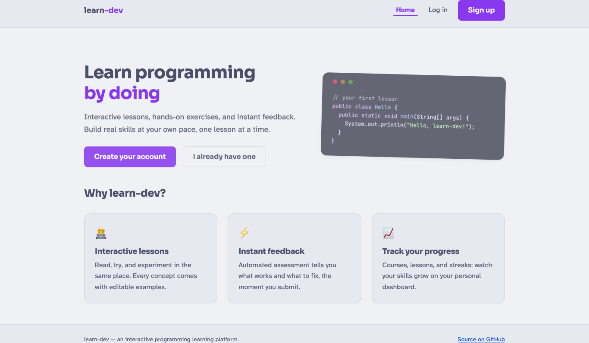
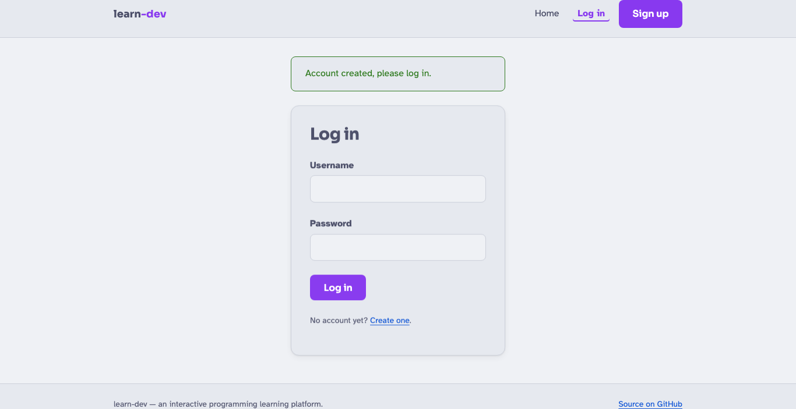
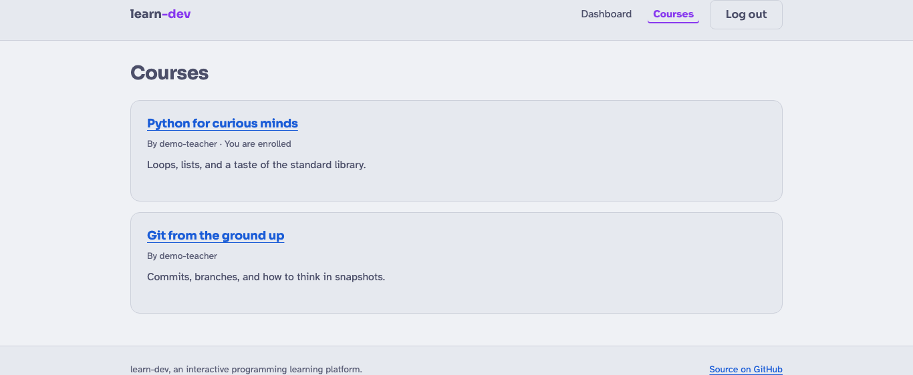
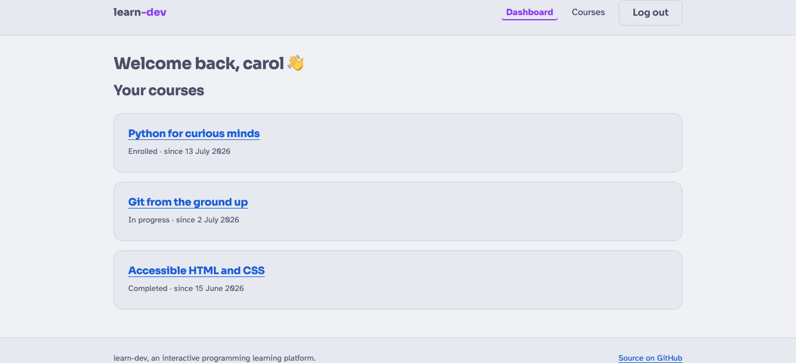
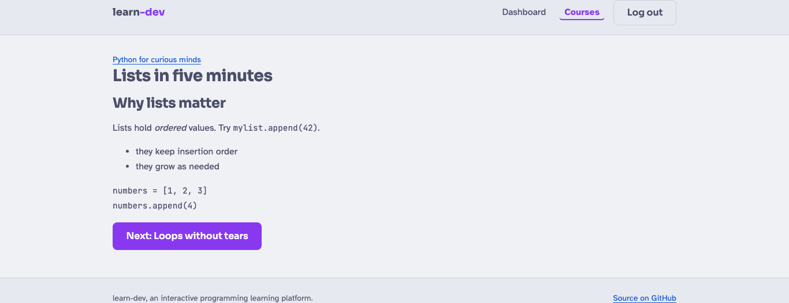
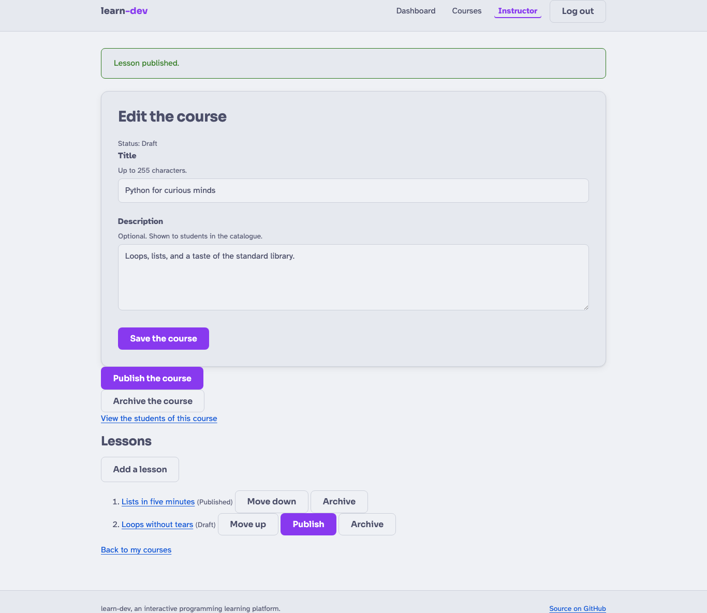

**Candidat :** Eric Bouchut — **Titre visé :** Développeur Web et Web Mobile (DWWM),
RNCP37674, niveau 5 (titre complet, 2 blocs) — **Centre de formation :** La Plateforme\_
— **Session :** août 2026 — **Projet :** *learn-dev*, plateforme d'apprentissage de la
programmation — **Dépôt :** <https://github.com/ebouchut/learn-dev>

```{=typst}
#pagebreak()
```

# Introduction

## Contexte de la formation

Ce dossier présente **learn-dev**, le projet de fin d'études que j'ai conçu et développé
seul dans le cadre de la formation *Développeur Web et Web Mobile* à La Plateforme\_. Il a
été pensé comme un projet « vitrine » couvrant l'ensemble des compétences du référentiel
DWWM : conception d'interfaces, développement front-end, modélisation et création d'une
base de données relationnelle, développement de composants d'accès aux données et de
composants métier côté serveur, sécurité applicative, tests et déploiement.

## Présentation du projet

**learn-dev** est une **plateforme d'apprentissage de la programmation** (application web
de type *Learning Management System*). Elle permet à des **formateurs** de publier des
**cours** composés de **leçons** rédigées en Markdown, et à des **étudiants** de parcourir
le catalogue, de s'inscrire aux cours et de suivre les leçons. Un rôle **administrateur**
assure la modération des contenus et la gestion des comptes.

L'application est une application web **rendue côté serveur** (server-side rendering)
construite avec **Spring Boot** (Java 21) et **Thymeleaf**, adossée à une base de données
**PostgreSQL**. Elle est entièrement **responsive** (utilisable sur mobile comme sur poste
de bureau) et conçue dès l'origine pour l'**accessibilité** (référentiel RGAA).

## Remerciements

Je remercie l'équipe pédagogique de La Plateforme\_ pour son accompagnement tout au long
de la formation, ainsi que la communauté open source dont les outils (Spring Boot,
PostgreSQL, Thymeleaf) ont rendu ce projet possible.

## Note de lecture

> Le code, les diagrammes et les mesures présentés dans ce dossier proviennent du dépôt
> réel du projet. Les extraits de code sont donnés dans des blocs balisés par langage. Les
> sections de conception (cahier des charges, personas) formalisent, pour les besoins du
> dossier, des choix effectivement mis en œuvre dans le projet.

```{=typst}
#pagebreak()
```

# Liste des compétences mises en œuvre

Le tableau ci-dessous relie chaque **compétence professionnelle (CP)** du référentiel
DWWM à une ou plusieurs réalisations concrètes de **learn-dev**, et renvoie à la section du
dossier qui la détaille. Le titre est organisé en deux blocs de compétences : **BC01 —
Développer la partie front-end** (CP1 à CP4) et **BC02 — Développer la partie back-end**
(CP5 à CP8).

## Bloc BC01 — Développer la partie front-end d'une application web

| CP | Compétence | Réalisation dans learn-dev | Section |
|----|------------|----------------------------|---------|
| CP1 | Installer et configurer son environnement de travail | Stack Java 21 / Spring Boot / PostgreSQL, conteneurs Podman (Postgres, Mongo, Mailpit), Maven Wrapper, Git, CI GitHub Actions | §6 |
| CP2 | Maquetter une application | Maquettes Figma + prototypes HTML, charte graphique, wireframes, enchaînement des écrans, conformité RGAA, versions web et web mobile | §5 |
| CP3 | Réaliser une interface utilisateur web statique et adaptable | 21 gabarits Thymeleaf, HTML5 sémantique, CSS responsive, thèmes, polices auto-hébergées | §7.1 |
| CP4 | Développer une interface utilisateur dynamique | Formulaires validés, retours d'erreur accessibles, motif Post-Redirect-Get, rendu Markdown des leçons, navigation entre leçons | §7.2 |

## Bloc BC02 — Développer la partie back-end d'une application web

| CP | Compétence | Réalisation dans learn-dev | Section |
|----|------------|----------------------------|---------|
| CP5 | Créer une base de données | Modélisation Merise (MCD/MLD/MPD), 9 tables PostgreSQL, migrations Liquibase, clés UUID/BIGINT, contraintes d'intégrité | §8.1 |
| CP6 | Développer les composants d'accès aux données | Repositories Spring Data JPA, requêtes dérivées, `@EntityGraph`, transactions ; MongoDB provisionné (voir §8.2) | §8.2 |
| CP7 | Développer des composants métier côté serveur | Services (`RegistrationService`, `EnrollmentService`, `InstructorCourseService`…), règles métier, gestion des erreurs HTTP | §8.3 |
| CP8 | Documenter le déploiement d'une application | Image Docker multi-étapes non-root, Docker Compose, profils dev/prod, variables d'environnement, procédure documentée, CI/CD | §11 |

Les compétences **CP2 à CP7** (obligatoirement couvertes par la présentation orale) sont
détaillées avec captures d'écran, extraits de code et diagrammes. Les compétences **CP1**
et **CP8** sont également traitées.

## Compétences transversales

Trois compétences transversales sont mobilisées en continu : **veille technologique et de
sécurité** (§12), **communication écrite** (documentation du projet : README, 14 décisions
d'architecture, glossaire) et **compréhension de l'anglais technique** (documentation,
nommage du code, écosystème).

```{=typst}
#pagebreak()
```

# Expression des besoins (cahier des charges)

## Problématique

Apprendre à programmer suppose un parcours structuré : du contenu pédagogique organisé, une
progression lisible, et un environnement où un formateur peut publier et faire évoluer ses
cours pendant que les étudiants s'y inscrivent et avancent à leur rythme. **learn-dev**
répond à ce besoin en fournissant une plateforme multi-rôles simple, sûre et accessible.

## Solution en une phrase

> *learn-dev est une plateforme web où des formateurs publient des cours composés de leçons
> en Markdown, et où des étudiants s'inscrivent et suivent ces cours.*

## Objectifs

- Permettre à un **étudiant** de créer un compte, parcourir le catalogue des cours publiés,
  s'inscrire à un cours et lire ses leçons.
- Permettre à un **formateur** de créer des cours et des leçons, de les faire passer par un
  cycle de vie (brouillon → publié → archivé) et de gérer les inscrits.
- Permettre à un **administrateur** de gérer les comptes (création de formateurs,
  verrouillage/déverrouillage, archivage) et de modérer les contenus.
- Garantir la **sécurité** (authentification, autorisation par rôle, protection des données)
  et l'**accessibilité** (RGAA) de l'application.

## Périmètre et limites

Le périmètre de la version livrée (v1) couvre l'authentification complète, la gestion des
cours et leçons, l'inscription des étudiants, l'administration et la modération. Sont
**hors périmètre** de la v1, et documentés comme évolutions : le suivi fin de progression
leçon par leçon (l'état de progression existe en base mais n'est pas encore piloté par une
interface complète), le stockage de contenu en base NoSQL (MongoDB est provisionné mais non
branché à une fonctionnalité — voir §8.2), et une API REST pour un futur client mobile
natif.

## Personas

| Persona | Rôle | Besoin principal |
|---------|------|------------------|
| **Léa, étudiante** | `STUDENT` | Trouver des cours, s'y inscrire et suivre les leçons simplement, sur mobile comme sur ordinateur. |
| **Marc, formateur** | `INSTRUCTOR` | Rédiger des cours en Markdown, contrôler leur publication et voir qui est inscrit. |
| **Awa, administratrice** | `ADMIN` | Gérer les comptes et modérer les contenus sans compromettre la sécurité. |

## Besoins fonctionnels

- **Comptes et sécurité :** inscription, connexion/déconnexion, vérification d'e-mail,
  réinitialisation de mot de passe, verrouillage après échecs de connexion répétés.
- **Cours (étudiant) :** catalogue des cours publiés, détail d'un cours, inscription et
  désinscription, lecture des leçons avec navigation précédent/suivant.
- **Cours (formateur) :** création/édition de cours et de leçons, cycle de vie de
  publication, réordonnancement des leçons, consultation et retrait des inscrits.
- **Administration :** liste des comptes, création de formateurs, verrouillage/archivage,
  modération des cours et leçons.

## Besoins non fonctionnels

- **Sécurité :** mots de passe hachés (BCrypt), protection CSRF, anti-XSS, anti-injection
  SQL, autorisation par rôle, traçabilité (journal d'audit).
- **Accessibilité :** conformité RGAA 4 / WCAG 2.1 AA (structure sémantique, contrastes,
  navigation clavier).
- **Compatibilité :** responsive web et web mobile ; navigateurs modernes.
- **Qualité :** tests automatisés, intégration continue, migrations de schéma versionnées.

```{=typst}
#pagebreak()
```

# Gestion de projet

Le projet a été mené en **solo**, avec une organisation inspirée des pratiques
professionnelles.

## Méthode et outils

- **Contrôle de version Git** avec une **stratégie par fonctionnalité** : chaque
  fonctionnalité est développée sur une branche dédiée (`feat/account-lockout`,
  `feat/email-verification`, `feat/instructor-course-authoring`,
  `feat/student-course-catalog`, `feat/markdown-rendering`, `feat/password-reset`…) puis
  fusionnée après relecture. Les commits suivent la convention *Conventional Commits*
  (`feat:`, `fix:`, `docs:`, `refactor:`…).
- **Découpage incrémental** : le développement a suivi une progression logique
  (authentification → domaine cours côté étudiant → *authoring* formateur → administration),
  documentée par des **plans** versionnés dans [`docs/plans/`](https://github.com/ebouchut/learn-dev/tree/dev/docs/plans).
- **Principe YAGNI** (*You Ain't Gonna Need It*) : les fonctionnalités non nécessaires à la
  v1 (par ex. le rôle `SUPERADMIN`) ont été explicitement différées plutôt qu'anticipées.

## Décisions d'architecture (ADR)

Les choix techniques structurants sont tracés sous forme de **14 ADR** (*Architecture
Decision Records*, format MADR) dans [`docs/adr/`](https://github.com/ebouchut/learn-dev/tree/dev/docs/adr). Chaque ADR documente le contexte, la
décision et ses conséquences. Liste complète :

| ADR | Décision |
|-----|----------|
| 0001 | Sessions serveur plutôt que JWT pour l'authentification navigateur |
| 0002 | Authentification service-à-service par jeton de service (anticipation) |
| 0003 | Clé primaire **UUID** pour `users`, **BIGINT** ailleurs |
| 0004 | **Mailpit** comme faux serveur SMTP local |
| 0005 | Migrations **Liquibase** écrites à la main plutôt que DDL généré |
| 0006 | Tester contre un **PostgreSQL réel** via Testcontainers |
| 0007 | **PostgreSQL** plutôt que MySQL |
| 0008 | Partage d'un conteneur Postgres singleton entre tests |
| 0009 | Exécuter les tests sous Surefire (pas Failsafe) |
| 0010 | Structurer la CI en workflows ciblés par préoccupation |
| 0011 | Démarrer les contrôles qualité de CI en mode consultatif |
| 0012 | Publier la couverture de tests sur Codecov |
| 0013 | Rendre le Markdown des leçons avec **commonmark-java** |
| 0014 | Rétrograder les titres Markdown des leçons (accessibilité) |

Cette traçabilité des décisions est un livrable de **communication écrite** à part entière
et un support précieux pour l'entretien technique.

```{=typst}
#pagebreak()
```

# Conception visuelle (CP2 — Maquetter une application)

## Démarche

L'aspect et l'ergonomie des écrans ont été **spécifiés avant le code** : une maquette
**Figma** définit la charte et les écrans, déclinée en **prototypes HTML** navigables (dans
[`docs/design/mockups/`](https://github.com/ebouchut/learn-dev/tree/dev/docs/design/mockups)). Cette approche « maquette d'abord » permet de valider les parcours
et l'accessibilité avant l'implémentation.

## Charte graphique

- **Deux thèmes** de couleurs sont fournis : *Catppuccin* (sombre) et *Soft Paper* (clair).
  Les contrastes ont été calculés pour respecter le seuil **WCAG AA** (rapport de contraste
  minimal mesuré 4,73:1), comme documenté dans [`docs/design/theme-exploration.md`](https://github.com/ebouchut/learn-dev/blob/dev/docs/design/theme-exploration.md).
- **Typographie accessible :** la police principale est **Atkinson Hyperlegible**, conçue
  pour la lisibilité des personnes malvoyantes ; les polices sont **auto-hébergées**
  (`.woff2` avec leur licence) pour la performance et la confidentialité.

## Wireframes et maquettes

Les écrans ont été maquettés pour une **version web** (poste de bureau) et une **version
web mobile**, conformément à l'exigence CP2. Le prototype HTML permet de naviguer entre les
écrans clés (accueil, inscription, connexion, tableau de bord, catalogue, détail d'un cours,
leçon, *authoring* formateur).

{ width=95% }

{ width=95% }

## Enchaînement des écrans

Le parcours nominal d'un étudiant relie les écrans dans l'ordre suivant :

> Accueil → Inscription → Connexion → Tableau de bord → Catalogue → Détail d'un cours →
> (Inscription au cours) → Leçon → Leçon suivante…

## Accessibilité (RGAA)

L'accessibilité est traitée **par construction** et documentée dans [`docs/rgaa.md`](https://github.com/ebouchut/learn-dev/blob/dev/docs/rgaa.md) (carte
des critères RGAA) et [`docs/rgaa-audit.md`](https://github.com/ebouchut/learn-dev/blob/dev/docs/rgaa-audit.md) (auto-audit outillé : Lighthouse, axe-core,
parcours clavier). Points clés :

- Structure sémantique avec repères (`header`, `nav`, `main`, `footer`) et **lien
  d'évitement** (*skip link*).
- Labels de formulaire explicites (`label for`), messages d'erreur reliés au champ
  (`aria-describedby`, `aria-invalid`, `role="alert"`).
- Indicateur de page courante (`aria-current="page"`), focus visible (`:focus-visible`),
  respect de `prefers-reduced-motion`.
- Gestion des changements de langue (`lang="fr"` sur la page de politique de
  confidentialité).

```{=typst}
#pagebreak()
```

# Environnement technique (CP1)

## Architecture applicative

learn-dev est un **monolithe Spring Boot en couches**, organisé **par fonctionnalité**
(*package-by-feature*) plutôt que par couche technique. Le flux d'une requête suit le motif
**MVC** : `Controller → Service → Repository → PostgreSQL`, le contrôleur renvoyant un nom
de vue logique résolu par **Thymeleaf**.

```
Navigateur ──HTTP──> Controller ──> Service (règles métier) ──> Repository (Spring Data JPA)
                         │                                              │
                         └──> Vue Thymeleaf <── Modèle          PostgreSQL 17
```

Le code (50 classes Java) est regroupé par domaine fonctionnel sous
`com.ericbouchut.learndev` :

```text
com.ericbouchut.learndev
├── auth/        inscription, connexion, vérification e-mail, reset mot de passe, verrouillage
├── user/        entité User et son repository
├── role/        entité Role et son repository
├── course/      cours, leçons, inscriptions, rendu Markdown (cœur métier)
├── admin/       gestion des comptes et modération
├── audit/       journal d'audit des événements sensibles
├── legal/       page de politique de confidentialité (RGPD)
└── common/      configuration transversale (SecurityConfig, CacheConfig)
```

## Pile technique

Extrait du catalogue technique ([`docs/tech-stacks.md`](https://github.com/ebouchut/learn-dev/blob/dev/docs/tech-stacks.md)), dont les versions proviennent de
[`pom.xml`](https://github.com/ebouchut/learn-dev/blob/dev/pom.xml), `.sdkmanrc` et [`docker-compose.yaml`](https://github.com/ebouchut/learn-dev/blob/dev/docker-compose.yaml) :

| Domaine | Technologie | Version | Rôle |
|---------|-------------|---------|------|
| Langage / runtime | Java | 21 (LTS) | Langage du projet, épinglé via `.sdkmanrc` |
| Framework | Spring Boot | 3.5.14 | MVC, Security, Data JPA, Mail, Validation |
| Vue | Thymeleaf | via Boot | Moteur de templates côté serveur |
| Contenu | commonmark-java | 0.24.0 | Rendu Markdown → HTML des leçons |
| Contenu | jsoup | 1.21.1 | Assainissement HTML (défense XSS) |
| Persistance | Hibernate ORM (JPA) | via Boot | Mapping objet-relationnel |
| Base de données | PostgreSQL | 17 | Cœur relationnel |
| Migrations | Liquibase | via Boot | Migrations de schéma au démarrage |
| Base NoSQL | MongoDB | 8 | Provisionné pour un stockage de contenu futur |
| Build | Maven (+ Wrapper) | 3.9.16 | Build et gestion des dépendances |
| Conteneurs | Podman / Docker Compose | — | Postgres, Mongo, Mailpit en local |
| Tests | JUnit 5, Mockito, AssertJ, Testcontainers | via Boot | Tests unitaires et d'intégration |
| CI / Qualité | GitHub Actions, Checkstyle, JaCoCo, Codecov | — | Intégration continue et couverture |

## Outils de développement

- **IDE :** IntelliJ IDEA / VS Code / WebStorm.
- **Gestion des versions Java/Maven :** SDKMAN (`sdk env`).
- **Secrets :** chargés depuis un fichier `.env` (via *spring-dotenv*), jamais versionné.
- **SMTP local :** Mailpit capte les e-mails en développement (interface web sur `:8025`).

## Justification des choix

- **Spring Boot / Java 21** : écosystème mature, LTS, sécurité intégrée (Spring Security).
- **Rendu côté serveur (Thymeleaf)** plutôt qu'une SPA : simplicité, sécurité (moins de
  surface d'attaque côté client), bon référencement, adéquation au périmètre (ADR-0001).
- **PostgreSQL** : conformité SQL, types riches (UUID, JSONB, INET), robustesse (ADR-0007).
- **Liquibase** : schéma versionné, reproductible et auditable (ADR-0005).

```{=typst}
#pagebreak()
```

# Réalisations front-end (CP3, CP4)

## Interfaces utilisateur statiques (CP3)

Les **21 gabarits Thymeleaf** produisent un HTML5 sémantique et responsive. Un fragment
partagé ([`fragments/layout.html`](https://github.com/ebouchut/learn-dev/blob/dev/src/main/resources/templates/fragments/layout.html)) fournit l'ossature commune (`head`, `header`, `footer`,
*skip link*, navigation adaptée au rôle via le dialecte `sec:`), ce qui évite la duplication
et garantit la cohérence.

Exemple — l'ossature d'un pied de page sémantique :

```html
<footer class="site-footer">
  <p>&copy; 2026 learn-dev. Apprendre en pratiquant.</p>
</footer>
```

Le **CSS** est organisé en fichiers dédiés ([`base.css`](https://github.com/ebouchut/learn-dev/blob/dev/src/main/resources/static/css/base.css), [`fonts.css`](https://github.com/ebouchut/learn-dev/blob/dev/src/main/resources/static/css/fonts.css),
[`theme-catppuccin.css`](https://github.com/ebouchut/learn-dev/blob/dev/src/main/resources/static/css/theme-catppuccin.css), [`theme-soft-paper.css`](https://github.com/ebouchut/learn-dev/blob/dev/src/main/resources/static/css/theme-soft-paper.css)). La mise en page est **responsive** : points
de rupture en `rem`, grilles `auto-fit`, tailles en unités relatives, vérifiée aux largeurs
375 px (mobile), 768 px (tablette) et 1440 px (bureau).

{ width=95% }

{ width=38% }

{ width=95% }

### Accessibilité et structure sémantique (RGAA)

L'accessibilité est traitée **par construction**. Le fragment de mise en page partagé fournit
un **lien d'évitement**, une navigation **adaptée au rôle** (dialecte `sec:`) et l'indication
de la page courante (`aria-current`) :

```html
<a class="skip-link" href="#main">Skip to main content</a>
<header class="site-header">
  <nav class="site-header__nav" aria-label="Main">
    <ul class="nav__list" sec:authorize="isAuthenticated()">
      <li><a class="nav__link" th:href="@{/dashboard}"
             th:attr="aria-current=${current == 'dashboard'} ? 'page' : null">Dashboard</a></li>
      <li sec:authorize="hasRole('INSTRUCTOR')">
        <a class="nav__link" th:href="@{/instructor/courses}">Instructor</a></li>
      <li sec:authorize="hasRole('ADMIN')">
        <a class="nav__link" th:href="@{/admin/users}">Admin</a></li>
    </ul>
  </nav>
</header>
```

Principaux critères **RGAA 4 / WCAG 2.1 AA** couverts (voir [`docs/rgaa.md`](https://github.com/ebouchut/learn-dev/blob/dev/docs/rgaa.md)) :

| Critère RGAA | Mise en œuvre dans learn-dev |
|--------------|------------------------------|
| 3.2 Contrastes | Rapport minimal mesuré 4,73:1 (thèmes calculés) |
| 8.x Structure | HTML5 sémantique : `header`, `nav`, `main`, `footer` |
| 9.1 Titres | Un seul `h1` par page ; titres de leçon rétrogradés (ADR-0014) |
| 10.x Présentation | Tailles en `rem`/`em`, focus visible (`:focus-visible`) |
| 11.x Formulaires | `label for`, `aria-invalid`, `aria-describedby`, `role="alert"` |
| 12.7 Navigation | Lien d'évitement vers le contenu principal |
| 13.8 Mouvement | Respect de `prefers-reduced-motion` |

## Partie dynamique des interfaces (CP4)

En rendu côté serveur, le **dynamisme** des interfaces repose sur le traitement des
formulaires, la validation, l'affichage conditionnel et le rendu de contenu :

- **Formulaires liés au modèle** avec Thymeleaf (`th:object`, `th:field`), pré-remplissage
  et ré-affichage des valeurs saisies en cas d'erreur.
- **Retours d'erreur accessibles** : chaque champ invalide reçoit `aria-invalid="true"` et
  un message relié par `aria-describedby`, une alerte `role="alert"` résume l'échec.
- **Affichage conditionnel selon le rôle** via `sec:authorize` (la navigation change selon
  que l'utilisateur est étudiant, formateur ou administrateur).
- **Motif Post-Redirect-Get (PRG)** : après une action (inscription à un cours, publication),
  une redirection évite la double soumission et affiche un message d'état.
- **Rendu dynamique du contenu** : les leçons rédigées en Markdown sont converties en HTML
  puis affichées, avec navigation *précédent / suivant*.

Extrait — un champ de formulaire dynamique et accessible (page d'inscription) :

```html
<div class="form__group">
  <label class="form__label" for="username">Username</label>
  <span class="form__hint" id="username-hint">3 to 50 characters.</span>
  <input class="form__input" type="text" th:field="*{username}"
         autocomplete="username" required
         th:classappend="${#fields.hasErrors('username')} ? 'form__input--invalid'"
         th:attr="aria-invalid=${#fields.hasErrors('username')} ? 'true' : null,
                  aria-describedby=${#fields.hasErrors('username')}
                    ? 'username-hint username-error' : 'username-hint'">
  <span class="form__error" id="username-error"
        th:if="${#fields.hasErrors('username')}" th:errors="*{username}"></span>
</div>
```

{ width=70% }

{ width=95% }

> **Point de transparence (CP4).** learn-dev étant rendu côté serveur, la part de
> **JavaScript côté client est volontairement réduite** : le dynamisme est assuré par le
> serveur (validation, PRG, rendu conditionnel). Ce choix est cohérent avec l'architecture
> (ADR-0001) et sera argumenté à l'oral.

```{=typst}
#pagebreak()
```

# Réalisations back-end (CP5, CP6, CP7)

## Base de données relationnelle (CP5)

### Modélisation Merise

La base a été modélisée selon la méthode **Merise**, du conceptuel au physique, à l'aide de
l'outil *Mocodo* (MCD/MLD) et *tbls* (MPD généré depuis le schéma vivant).

{ width=62% }

Le **Modèle Logique de Données (MLD)** dérivé (les clés primaires sont soulignées, les clés
étrangères préfixées par `#`) :

- **User** (<u>user_id</u>, username, email, password, first_name, last_name, is_active,
  is_verified, is_locked, failed_login_attempts, last_login_at, password_changed_at)
- **Role** (<u>role_id</u>, role_name, description, is_active)
- **Holds** (<u>#user_id</u>, <u>#role_id</u>, assigned_at, assigned_by)
- **Course** (<u>course_id</u>, title, description, status, published_at, created_at,
  updated_at, #user_id)
- **Lesson** (<u>lesson_id</u>, title, content_markdown, position, status, created_at,
  updated_at, #course_id)
- **Enrolls** (<u>#user_id</u>, <u>#course_id</u>, status, enrolled_at, completed_at,
  dropped_at)
- **Email Token** (<u>token_id</u>, token, expires_at, used_at, #user_id)
- **Reset Token** (<u>token_id</u>, token, expires_at, used_at, ip_address, #user_id)
- **Audit Log** (<u>log_id</u>, action_type, entity_type, entity_id, description,
  ip_address, user_agent, was_successful, error_message, metadata, created_at, #user_id)

{ width=95% }

### Schéma physique et migrations

Le schéma comporte **9 tables**. Il est créé et versionné par **16 migrations Liquibase**
(un changeset atomique par fichier, en mode *append-only*), appliquées au démarrage.
Hibernate est configuré en `ddl-auto: validate` : il **ne génère jamais** le schéma, il se
contente de vérifier que les entités correspondent aux tables.

Extrait — création de la table `users` (clé primaire **UUID**, contraintes d'unicité) :

```sql
CREATE TABLE users (
    user_id               UUID         PRIMARY KEY DEFAULT gen_random_uuid(),
    username              VARCHAR(50)  NOT NULL UNIQUE,
    email                 VARCHAR(255) NOT NULL UNIQUE,
    password              VARCHAR(255) NOT NULL,          -- hash bcrypt, jamais en clair
    first_name            VARCHAR(100),
    last_name             VARCHAR(100),
    is_active             BOOLEAN      NOT NULL DEFAULT TRUE,
    is_verified           BOOLEAN      NOT NULL DEFAULT FALSE,
    is_locked             BOOLEAN      NOT NULL DEFAULT FALSE,
    failed_login_attempts INTEGER      NOT NULL DEFAULT 0,
    last_login_at         TIMESTAMPTZ,
    password_changed_at   TIMESTAMPTZ
);
```

Extrait — table d'association `enrollments` (clé primaire **composite**, contrainte
`CHECK` sur le statut, suppression en cascade) :

```sql
CREATE TABLE enrollments (
    user_id      UUID        NOT NULL REFERENCES users (user_id) ON DELETE CASCADE,
    course_id    BIGINT      NOT NULL REFERENCES courses (course_id) ON DELETE CASCADE,
    status       VARCHAR(20) NOT NULL DEFAULT 'ENROLLED'
        CONSTRAINT chk_enrollments_status
        CHECK (status IN ('ENROLLED', 'IN_PROGRESS', 'COMPLETED', 'DROPPED')),
    enrolled_at  TIMESTAMPTZ NOT NULL DEFAULT now(),
    completed_at TIMESTAMPTZ,
    dropped_at   TIMESTAMPTZ,
    PRIMARY KEY (user_id, course_id)
);
```

Extrait — table `lessons` (identité `BIGINT` auto-générée, ordre unique par cours via
`UNIQUE (course_id, position)`, suppression en cascade) :

```sql
CREATE TABLE lessons (
    lesson_id        BIGINT       GENERATED ALWAYS AS IDENTITY PRIMARY KEY,
    title            VARCHAR(255) NOT NULL,
    content_markdown TEXT         NOT NULL DEFAULT '',
    position         INTEGER      NOT NULL,
    status           VARCHAR(20)  NOT NULL DEFAULT 'DRAFT'
        CONSTRAINT chk_lessons_status CHECK (status IN ('DRAFT', 'PUBLISHED', 'ARCHIVED')),
    created_at       TIMESTAMPTZ  NOT NULL DEFAULT now(),
    updated_at       TIMESTAMPTZ  NOT NULL DEFAULT now(),
    course_id        BIGINT       NOT NULL REFERENCES courses (course_id) ON DELETE CASCADE,
    CONSTRAINT uq_lessons_course_position UNIQUE (course_id, position)
);
```

### Choix de conception

- **UUID pour `users`** (BIGINT ailleurs) : un identifiant non séquentiel n'est pas
  énumérable, ce qui **atténue les attaques IDOR** et prépare une future exposition en API
  (ADR-0003).
- **Clés composites comme identité naturelle** (`user_roles`, `enrollments`) : pas de clé
  de substitution superflue.
- **Contraintes en base** (`UNIQUE`, `CHECK`, `FK`, `NOT NULL`) : l'intégrité est garantie
  au plus près des données, indépendamment de l'application.
- **Index explicites** (`idx_enrollments_course_id`, `idx_courses_instructor_id`…) pour les
  accès fréquents.
- **Contrôle anti-dérive de schéma** : un workflow d'intégration continue vérifie la
  cohérence entre les migrations Liquibase et le MPD.

## Composants d'accès aux données (CP6)

L'accès aux données relationnelles s'appuie sur **Spring Data JPA** : les *repositories*
sont des interfaces dont Spring génère l'implémentation. Les requêtes sont **dérivées du
nom de méthode** ou paramétrées, ce qui **exclut la concaténation de SQL** (défense contre
l'injection).

L'entité `User` illustre le mapping objet-relationnel (JPA) et le choix de la clé UUID :

```java
@Entity
@Table(name = "users")
@Getter @Setter @NoArgsConstructor
public class User {

    @Id
    @GeneratedValue(strategy = GenerationType.UUID)
    @Column(name = "user_id")
    private UUID userId;

    @Column(name = "username", nullable = false, unique = true)
    private String username;

    @Column(name = "email", nullable = false, unique = true)
    private String email;

    @Column(name = "password", nullable = false)
    private String password;   // hash BCrypt

    // Association N-N vers les rôles, matérialisée par la table user_roles
    @ManyToMany
    @JoinTable(name = "user_roles",
            joinColumns = @JoinColumn(name = "user_id"),
            inverseJoinColumns = @JoinColumn(name = "role_id"))
    private Set<Role> roles = new HashSet<>();
}
```

Le *repository* correspondant est une simple **interface** : Spring Data JPA en génère
l'implémentation. Les accès sont typés (`existsByUsername`, `existsByEmail`) et
`findByUsername` charge les rôles en une seule requête grâce à `@EntityGraph` :

```java
public interface UserRepository extends JpaRepository<User, UUID> {

    // Charge l'utilisateur AVEC ses rôles en une seule requête (les rôles sont
    // en chargement paresseux ; l'authentification est le chemin qui en a besoin).
    @EntityGraph(attributePaths = "roles")
    Optional<User> findByUsername(String username);

    Optional<User> findByEmail(String email);
    boolean existsByUsername(String username);
    boolean existsByEmail(String email);
}
```

Les requêtes générées sont **paramétrées** (aucune concaténation de SQL), ce qui écarte par
construction l'injection SQL.

> **Point de transparence (CP6 — NoSQL).** Le référentiel mentionne l'accès aux données
> « SQL **et** NoSQL ». Dans learn-dev, l'accès **SQL** (Spring Data JPA sur PostgreSQL) est
> le cœur fonctionnel. **MongoDB** est **provisionné** (conteneur Docker) et **configuré**
> (URI de connexion) en vue d'un stockage de contenu futur, mais **n'est pas encore branché**
> à une fonctionnalité. Cet écart est assumé et documenté ; il pourra être comblé par une
> fonctionnalité NoSQL dédiée avant la soutenance.

## Composants métier côté serveur (CP7)

La logique métier est portée par des **services** (`@Service`) transactionnels, distincts
des contrôleurs (web) et des *repositories* (données). Chaque service encapsule des règles
et lève des erreurs HTTP explicites (403/404/409) via `ResponseStatusException`.

Exemples de règles métier implémentées :

- **`RegistrationService`** : unicité du `username`/`email`, hachage du mot de passe,
  attribution du rôle `STUDENT` par défaut (voir §10, jeu d'essai).
- **`EnrollmentService`** : inscription/désinscription **idempotentes**, réactivation d'une
  inscription abandonnée (`DROPPED`).
- **`InstructorCourseService`** : cycle de vie `DRAFT → PUBLISHED → ARCHIVED`, transitions
  invalides refusées (409), réordonnancement des leçons, contrôle d'appartenance (un
  formateur ne peut modifier que ses cours, sinon 403).
- **`CourseService`** : règle de visibilité (un cours `PUBLISHED` est visible ; `DRAFT`
  jamais ; `ARCHIVED` reste lisible pour l'inscrit ; un contenu invisible renvoie **404** et
  non 403, pour ne pas divulguer l'existence de la ressource).

Extrait — le cœur de `RegistrationService.register` (règle d'unicité, hachage, rôle par
défaut, et **rattrapage d'une situation de concurrence** sur la contrainte d'unicité) :

```java
@Transactional
public User register(RegisterForm form, String roleName) {
    if (users.existsByUsername(form.username())) {
        throw new DuplicateUsernameException(form.username());
    }
    if (users.existsByEmail(form.email())) {
        throw new DuplicateEmailException(form.email());
    }
    Role role = roles.findByRoleName(roleName)
            .orElseThrow(() -> new IllegalStateException(roleName + " role not seeded"));

    User user = new User();
    user.setUsername(form.username());
    user.setEmail(form.email());
    user.setPassword(encoder.encode(form.password()));   // hachage BCrypt
    user.getRoles().add(role);

    // Les pré-vérifications existsBy* peuvent être « doublées » sous forte
    // concurrence : deux requêtes les passent, et la perdante heurte la
    // contrainte UNIQUE. On flushe ici (saveAndFlush) pour capter la violation
    // et la retraduire en exception métier selon le nom de la contrainte.
    try {
        return users.saveAndFlush(user);
    } catch (DataIntegrityViolationException e) {
        String constraint = constraintName(e);
        if ("users_username_key".equalsIgnoreCase(constraint)) {
            throw new DuplicateUsernameException(form.username());
        }
        if ("users_email_key".equalsIgnoreCase(constraint)) {
            throw new DuplicateEmailException(form.email());
        }
        throw e;
    }
}
```

Extrait — `EnrollmentService.enroll` : l'inscription est **idempotente** et **réactive** une
inscription précédemment abandonnée plutôt que d'en créer une seconde (la clé primaire est
le couple `(étudiant, cours)`) :

```java
@Transactional
public void enroll(User student, Course course) {
    Optional<Enrollment> existing = enrollments.findByUserAndCourse(student, course);
    if (existing.isPresent() && existing.get().getStatus() != EnrollmentStatus.DROPPED) {
        return;                                   // déjà inscrit : ne rien faire (idempotent)
    }
    if (course.getStatus() != PublicationStatus.PUBLISHED) {
        throw new ResponseStatusException(HttpStatus.NOT_FOUND);   // seuls les cours publiés
    }
    if (existing.isPresent()) {                   // réactivation d'une inscription abandonnée
        Enrollment enrollment = existing.get();
        enrollment.setStatus(EnrollmentStatus.ENROLLED);
        enrollment.setDroppedAt(null);
        enrollment.setEnrolledAt(OffsetDateTime.now());
        enrollments.save(enrollment);
    } else {
        enrollments.save(new Enrollment(student, course));
    }
}
```

Les cycles de vie du domaine sont explicites : une **inscription** évolue selon
`ENROLLED → IN_PROGRESS → COMPLETED` (ou `DROPPED`) ; un **cours** et une **leçon** selon
`DRAFT → PUBLISHED → ARCHIVED`, les transitions invalides étant refusées (`409 Conflict`).

### Cycle de vie et règles de visibilité

La publication d'un cours ne s'effectue que depuis l'état `DRAFT` (la date de première
publication est horodatée une seule fois) ; toute transition interdite lève un `409` :

```java
@Transactional
public void publish(Course course, User actor, String ipAddress) {
    requireStatus(course.getStatus(), PublicationStatus.DRAFT);
    course.setStatus(PublicationStatus.PUBLISHED);
    if (course.getPublishedAt() == null) {
        course.setPublishedAt(OffsetDateTime.now());
    }
    courses.save(course);
    audit.record("COURSE_PUBLISHED", actor, ipAddress, true,
            "Course " + course.getCourseId() + " published");
}

private static void requireStatus(PublicationStatus actual, PublicationStatus... allowed) {
    for (PublicationStatus status : allowed) {
        if (actual == status) return;
    }
    throw new ResponseStatusException(HttpStatus.CONFLICT,
            "Transition not allowed from " + actual);
}
```

Côté étudiant, la **règle de visibilité** décide de ce qui est accessible : un cours
`PUBLISHED` est visible ; un cours `ARCHIVED` reste lisible pour un inscrit ; sinon la
réponse est **404** (et non 403), afin de ne pas révéler l'existence d'un brouillon :

```java
public Course visibleCourse(Long courseId, User student) {
    Course course = courses.findById(courseId).orElseThrow(CourseService::notFound);
    if (course.getStatus() == PublicationStatus.PUBLISHED) {
        return course;
    }
    boolean enrolledInArchived = course.getStatus() == PublicationStatus.ARCHIVED
            && enrollments.findByUserAndCourse(student, course).isPresent();
    if (enrolledInArchived) {
        return course;
    }
    throw notFound();   // 404 : ne divulgue pas l'espace d'URL des brouillons
}
```

```{=typst}
#pagebreak()
```

# Sécurité de l'application

La sécurité est traitée de façon transversale et s'appuie sur **Spring Security** et sur des
choix de conception défensifs.

{ width=70% }

## Authentification et autorisation

- **Authentification par session serveur** (cookie `JSESSIONID`), sans JWT pour le flux
  navigateur (ADR-0001).
- **Autorisation par rôle** déclarée dans la chaîne de filtres, et règles métier au niveau
  des services (`@EnableMethodSecurity`).

```java
http.authorizeHttpRequests(auth -> auth
        .dispatcherTypeMatchers(DispatcherType.ERROR).permitAll()
        .requestMatchers("/", "/privacy", "/auth/**", "/css/**", "/js/**", "/fonts/**").permitAll()
        .requestMatchers("/instructor/**").hasRole("INSTRUCTOR")
        .requestMatchers("/admin/**").hasRole("ADMIN")
        .requestMatchers("/courses/**").authenticated()
        .anyRequest().authenticated())
    .formLogin(form -> form
        .loginPage("/auth/login")
        .defaultSuccessUrl("/dashboard", true)
        .permitAll())
    .logout(logout -> logout
        .logoutUrl("/auth/logout")
        .logoutSuccessUrl("/auth/login?logout"));
// La protection CSRF est active par défaut ; Thymeleaf ajoute le jeton aux formulaires.
```

## Protection des données et défenses applicatives

- **Mots de passe : BCrypt** (`BCryptPasswordEncoder`) ; le mot de passe en clair n'est
  jamais persisté.
- **CSRF** : activée par défaut, jeton injecté dans chaque formulaire par Thymeleaf.
- **Anti-XSS** : échappement Thymeleaf par défaut, **et** assainissement du HTML issu du
  Markdown des leçons par **jsoup** (liste blanche) — aucun `<script>`, gestionnaire
  d'événement ou `<iframe>` ne survit (voir extrait CP4/§ ci-dessous).
- **Anti-injection SQL** : requêtes paramétrées via Spring Data JPA, aucune concaténation.
- **Anti-IDOR / anti-énumération** : identifiants **UUID** pour les utilisateurs ; réponses
  **404** (et non 403) sur les ressources invisibles ; réponses **neutres** sur la
  réinitialisation de mot de passe et la connexion.
- **Verrouillage de compte** après un seuil d'échecs de connexion consécutifs, avec
  déverrouillage par l'administrateur ou par réinitialisation.
- **Jetons** (vérification e-mail, réinitialisation) : 256 bits (`SecureRandom`), stockés
  **uniquement en SHA-256**, durée de vie courte, usage unique, un seul actif par
  utilisateur ; le jeton brut n'apparaît que dans le lien envoyé par e-mail.
- **Limitation de débit** (*rate limiting*) sur les demandes de réinitialisation (par
  utilisateur et par adresse IP).
- **Journal d'audit** (`audit_logs`) pour les événements sensibles (réinitialisation,
  verrouillage, publication, archivage, création de compte).

Extrait — assainissement anti-XSS du HTML produit à partir du Markdown des leçons :

```java
// Le contenu des leçons est saisi par le formateur et CommonMark laisse passer
// le HTML brut : la sortie est donc assainie contre une liste blanche.
private static final Safelist SAFELIST = Safelist.relaxed().addAttributes("code", "class");

public String render(String markdown) {
    if (markdown == null || markdown.isBlank()) {
        return "";
    }
    String html = renderer.render(parser.parse(markdown));
    return Jsoup.clean(html, SAFELIST);   // aucun <script>/handler/iframe ne survit
}
```

## Chargement de l'utilisateur pour l'authentification

Spring Security délègue le chargement de l'utilisateur à `CustomUserDetailsService`, qui lit
l'utilisateur et ses rôles depuis PostgreSQL, transmet le **hash** du mot de passe (la
comparaison est faite par Spring Security) et propage les états `locked` / `disabled` :

```java
@Override
public UserDetails loadUserByUsername(String username) {
    var user = users.findByUsername(username)
            .orElseThrow(() -> new UsernameNotFoundException("Unknown user: " + username));

    List<SimpleGrantedAuthority> authorities = user.getRoles().stream()
            .map(role -> new SimpleGrantedAuthority("ROLE_" + role.getRoleName()))
            .toList();

    return org.springframework.security.core.userdetails.User.builder()
            .username(user.getUsername())
            .password(user.getPassword())            // hash BCrypt (jamais le mot de passe en clair)
            .authorities(authorities)
            .accountLocked(user.isLocked())          // prise en compte du verrouillage de compte
            .disabled(!user.isActive())
            .build();
}
```

## Parcours d'authentification (séquence)

Le parcours de **connexion** (traité par Spring Security) suit la séquence suivante :

1. `GET /auth/login` → affichage du formulaire (avec jeton CSRF).
2. `POST /auth/login` (identifiant + mot de passe + CSRF).
3. `CustomUserDetailsService` charge l'utilisateur et ses rôles depuis PostgreSQL.
4. Vérification du mot de passe contre son **hash BCrypt** ; si échec → `302 /auth/login?error`.
5. Création de la session, `Set-Cookie: JSESSIONID` (`HttpOnly`, `SameSite=Lax`).
6. `302 /dashboard` → rendu du tableau de bord.

## Verrouillage de compte

Un écouteur d'événements Spring Security compte les échecs de connexion **consécutifs** et
**verrouille le compte** au seuil configuré ; une connexion réussie remet le compteur à zéro.
Les échecs pour un identifiant **inconnu** sont ignorés (aucune différence de comportement qui
pourrait révéler l'existence d'un compte) :

```java
@EventListener
@Transactional
public void onFailure(AuthenticationFailureBadCredentialsEvent event) {
    String username = event.getAuthentication().getName();
    users.findByUsername(username).ifPresent(user -> {
        if (user.isLocked()) return;
        user.setFailedLoginAttempts(user.getFailedLoginAttempts() + 1);
        if (user.getFailedLoginAttempts() >= maxAttempts) {
            user.setLocked(true);
            audit.record("ACCOUNT_LOCKED", user, null, true,
                    "Locked after " + user.getFailedLoginAttempts() + " failed attempts");
        }
        users.save(user);
    });
}
```

Le déverrouillage passe par l'administrateur ou par une réinitialisation de mot de passe
réussie (qui prouve le contrôle de la boîte mail).

## Réinitialisation de mot de passe (sécurisée)

Le parcours « mot de passe oublié » concentre plusieurs défenses : jeton **aléatoire de 256
bits** (`SecureRandom`), **stocké uniquement en SHA-256**, à **durée de vie courte** et à
**usage unique**, **limitation de débit** par utilisateur et par adresse IP, et **réponse
neutre** (anti-énumération) quel que soit le cas :

```java
@Transactional
public void requestReset(String email, String ipAddress, String resetUrlBase) {
    Optional<User> found = users.findByEmail(email);
    if (found.isEmpty()) {                       // e-mail inconnu : réponse neutre
        audit.record("PASSWORD_RESET_REQUESTED", null, ipAddress, false,
                "Reset requested for an unknown email");
        return;
    }
    User user = found.get();
    // ... limitation de débit par utilisateur et par IP (réponse neutre si dépassée) ...
    invalidateOutstandingTokens(user);           // un seul lien actif à la fois
    String rawToken = generateRawToken();        // 256 bits, base64url
    PasswordResetToken token = new PasswordResetToken();
    token.setToken(sha256(rawToken));            // seul le hash SHA-256 est stocké
    token.setExpiresAt(OffsetDateTime.now().plus(tokenTtl));
    token.setUser(user);
    tokens.save(token);
    mailer.sendResetEmail(user.getEmail(), resetUrlBase + "?token=" + rawToken);
}
```

Déroulé complet :

1. `POST /auth/forgot-password` → réponse **neutre** (`?sent`) dans tous les cas.
2. Si l'e-mail existe et que la limite n'est pas atteinte : invalidation des jetons en cours,
   stockage du **SHA-256** d'un nouveau jeton, envoi du lien (le jeton brut n'existe que dans
   l'e-mail).
3. `GET /auth/reset-password?token=…` → recherche par `SHA-256(token)`, non expiré, non
   utilisé ; affichage du formulaire (ou message « lien invalide »).
4. `POST /auth/reset-password` → stockage du **hash BCrypt** du nouveau mot de passe,
   consommation du jeton, **déverrouillage** du compte, invalidation des autres jetons, audit.

```{=typst}
#pagebreak()
```

# Tests et jeu d'essai

## Stratégie de tests

Le projet compte **64 méthodes de test** réparties sur 20 fichiers, organisées en pyramide
(voir ADR-0006/0008/0009) :

- **Tests unitaires** (Mockito, sans I/O) : services métier (`RegistrationServiceTest`,
  `EnrollmentServiceTest`, `InstructorCourseServiceTest`, `MarkdownRendererTest`…).
- **Tests de tranche `@DataJpaTest`** sur **PostgreSQL réel** via **Testcontainers**
  (`UserRepositoryTest`, `CourseDomainRepositoryTest`…).
- **Tests d'intégration / bout en bout** (contexte complet + MockMvc) :
  `AuthFlowTest`, `PasswordResetFlowTest`, `AccountLockoutFlowTest`, `AdminFlowTest`,
  `InstructorCourseFlowTest`, `StudentCourseFlowTest`…
- **Test de la matrice de sécurité** (`SecurityMatrixTest`) : vérifie les autorisations par
  rôle et par URL.

La **couverture** est mesurée par **JaCoCo** à chaque exécution (`mvn test`) et publiée sur
**Codecov** (badge et rapport de couverture, ADR-0012).

Les tests d'intégration s'exécutent contre un **vrai PostgreSQL** fourni par
**Testcontainers**, partagé en **singleton** pour tout le lot de tests (démarré une seule fois,
réutilisé par toutes les classes) :

```java
public abstract class AbstractPostgresIT {

    @ServiceConnection
    static final PostgreSQLContainer<?> POSTGRES =
            new PostgreSQLContainer<>("postgres:17");

    static {
        POSTGRES.start();   // démarré une seule fois pour tout le run de tests
    }
}
```

Ce choix (documenté en ADR-0006 et ADR-0008) permet de tester le **schéma réel** — types
`UUID`, `TIMESTAMPTZ`, contraintes, migrations Liquibase — qu'une base H2 en mémoire ne
reproduirait pas fidèlement.

## Jeu d'essai — Inscription d'un utilisateur

La fonctionnalité la plus représentative retenue est l'**inscription d'un utilisateur**
(`POST /auth/register`) : elle mobilise la validation des entrées (Bean Validation),
l'unicité en base, le hachage BCrypt et la gestion d'erreurs accessibles. Le tableau
ci-dessous présente le jeu d'essai (les résultats obtenus correspondent au comportement
vérifié par les tests automatisés et l'exécution de l'application).

| # | Scénario | Données en entrée | Résultat attendu | Résultat obtenu | Écart |
|---|----------|-------------------|------------------|-----------------|-------|
| 1 | Cas nominal | username `lea` (5), email `lea@example.com`, mot de passe `secret12` (8) | Compte créé, mot de passe **haché**, rôle `STUDENT`, redirection `/auth/login?registered` | Conforme | Aucun |
| 2 | E-mail déjà utilisé | email existant | Erreur de champ « Email already registered », formulaire ré-affiché, **aucune** création | Conforme | Aucun |
| 3 | Nom d'utilisateur déjà pris | username existant | Erreur de champ « Username already taken », **aucune** création | Conforme | Aucun |
| 4 | Mot de passe trop court | mot de passe `abc` (3 car.) | Rejet par `@Size(min=8)`, message d'erreur relié au champ | Conforme | Aucun |
| 5 | Nom d'utilisateur trop court | username `ab` (2 car.) | Rejet par `@Size(min=3)` | Conforme | Aucun |
| 6 | E-mail au format invalide | email `pas-un-email` | Rejet par `@Email` | Conforme | Aucun |
| 7 | Champs vides | username / email / mot de passe vides | Rejet par `@NotBlank` sur chaque champ | Conforme | Aucun |
| 8 | Concurrence (course condition) | deux inscriptions simultanées, même username | La perdante est retraduite en « Username already taken » (contrainte UNIQUE captée) | Conforme | Aucun |

Les contraintes de validation sont déclarées sur le DTO d'entrée (`RegisterForm`) :

```java
public record RegisterForm(
        @NotBlank @Size(min = 3, max = 50)  String username,
        @NotBlank @Email @Size(max = 255)   String email,
        @NotBlank @Size(min = 8, max = 100) String password
) {}
```

Le contrôleur transforme les échecs de validation et les doublons en **erreurs de champ**,
de sorte que le formulaire est ré-affiché avec la saisie de l'utilisateur :

```java
@PostMapping("/auth/register")
public String register(@Valid @ModelAttribute("form") RegisterForm form,
                       BindingResult binding, HttpServletRequest request) {
    if (binding.hasErrors()) {
        return "register";                     // ré-affichage avec messages d'erreur
    }
    try {
        User user = registration.register(form);
        verification.sendVerification(user, request.getRemoteAddr(),
                EmailVerificationController.verifyUrlBase(request));
    } catch (DuplicateUsernameException e) {
        binding.rejectValue("username", "duplicate", "Username already taken");
        return "register";
    } catch (DuplicateEmailException e) {
        binding.rejectValue("email", "duplicate", "Email already registered");
        return "register";
    }
    return "redirect:/auth/login?registered";  // Post-Redirect-Get
}
```

Ces scénarios sont couverts par des tests automatisés, par exemple le hachage du mot de
passe et l'attribution du rôle par défaut :

```java
@Test
void hashes_the_password_and_assigns_the_STUDENT_role() {
    stubHappyPath();
    User created = service.register(new RegisterForm("lea", "lea@example.com", "secret12"));
    assertThat(created.getPassword()).isEqualTo("HASHED");                     // haché, pas en clair
    assertThat(created.getRoles()).extracting(Role::getRoleName).containsExactly("STUDENT");
    verify(users).saveAndFlush(any(User.class));
}
```

La **matrice d'autorisations** est verrouillée par un test dédié (`SecurityMatrixTest`) : pour
chaque préfixe d'URL protégé, l'anonyme est redirigé vers la connexion, le mauvais rôle reçoit
`403`, et le bon rôle atteint la page (`200`) :

```java
@Test
@WithMockUser(roles = "STUDENT")
void student_is_denied_instructor_and_admin() throws Exception {
    mvc.perform(get("/instructor/courses")).andExpect(status().isForbidden());
    mvc.perform(get("/admin/users")).andExpect(status().isForbidden());
}

@Test
void instructor_passes_instructor_gate() throws Exception {
    mvc.perform(get("/instructor/courses")
                    .with(user("matrix-instructor").roles("INSTRUCTOR")))
            .andExpect(status().isOk());
}
```

```{=typst}
#pagebreak()
```

# Déploiement (CP8)

Conformément au référentiel, c'est la **qualité de la procédure documentée** qui est
évaluée, l'objectif n'étant pas une mise en production réelle.

## Conteneurisation

- **Image Docker multi-étapes** : build Maven puis image d'exécution **non-root**
  ([`Dockerfile`](https://github.com/ebouchut/learn-dev/blob/dev/Dockerfile)), le fichier `.env` étant exclu des artefacts.
- **Docker Compose** ([`docker-compose.yaml`](https://github.com/ebouchut/learn-dev/blob/dev/docker-compose.yaml)) orchestre en local **PostgreSQL 17**,
  **MongoDB 8** et **Mailpit** sur un réseau isolé, avec volumes nommés pour la persistance.

Extrait du [`Dockerfile`](https://github.com/ebouchut/learn-dev/blob/dev/Dockerfile) (image **multi-étapes** : build Maven, puis exécution **non-root**) :

```dockerfile
# ---- Étape 1 : construction du jar exécutable ----
FROM maven:3.9-eclipse-temurin-21 AS build
WORKDIR /workspace
COPY pom.xml .
RUN mvn -q -B dependency:go-offline          # cache des dépendances
COPY src ./src
RUN mvn -q -B -DskipTests package

# ---- Étape 2 : runtime minimal ----
FROM eclipse-temurin:21-jre
WORKDIR /app
RUN useradd --system --home /app learndev
USER learndev                                 # exécution non-root
COPY --from=build /workspace/target/*.jar app.jar
ENV SPRING_PROFILES_ACTIVE=prod
EXPOSE 8080
ENTRYPOINT ["java", "-jar", "app.jar"]
```

## Procédure de démarrage (local / dev)

```bash
# 1. Démarrer les services (base de données, SMTP local)
docker compose up -d

# 2. Lancer l'application (http://localhost:8080)
./mvnw spring-boot:run
```

## Profils et configuration

- **Profils Spring** : [`application.yaml`](https://github.com/ebouchut/learn-dev/blob/dev/src/main/resources/application.yaml) (base), [`application-dev.yaml`](https://github.com/ebouchut/learn-dev/blob/dev/src/main/resources/application-dev.yaml),
  [`application-prod.yaml`](https://github.com/ebouchut/learn-dev/blob/dev/src/main/resources/application-prod.yaml).
- **Production** : derrière un reverse-proxy TLS, en-têtes `X-Forwarded-*`, SMTP réel,
  cookie de session `Secure`, image non-root.
- **Secrets** : injectés via `.env` (jamais versionné).

## Intégration continue

Quatre workflows **GitHub Actions** couvrent le *build*, les *tests*, le *lint*
(Checkstyle) et le contrôle **anti-dérive de schéma** (cohérence migrations ↔ MPD). La
couverture est publiée sur Codecov.

Extrait du workflow de tests ([`.github/workflows/test.yml`](https://github.com/ebouchut/learn-dev/blob/dev/.github/workflows/test.yml)) — la suite s'exécute sur chaque
*push* et *pull request*, et la couverture JaCoCo est publiée :

```yaml
jobs:
  test:
    runs-on: ubuntu-latest
    steps:
      - uses: actions/checkout@v7
      - uses: actions/setup-java@v5
        with:
          distribution: temurin
          java-version: "21"
          cache: maven
      - name: Run the test suite
        run: ./mvnw -B -ntp test
      - name: Upload coverage to Codecov
        uses: codecov/codecov-action@v7
        with:
          token: ${{ secrets.CODECOV_TOKEN }}
          files: target/site/jacoco/jacoco.xml
```

```{=typst}
#pagebreak()
```

# Veille technologique et de sécurité

Une veille continue a accompagné le projet :

- **Analyse statique de sécurité** avec **Semgrep** (exécutée en *hook* d'outillage) pour
  détecter les motifs à risque dans le code.
- **Suivi des dépendances** et des versions (Spring Boot, PostgreSQL, bibliothèques) ;
  politique de sécurité documentée dans [`SECURITY.md`](https://github.com/ebouchut/learn-dev/blob/dev/SECURITY.md).
- **Référence OWASP** : les défenses implémentées adressent plusieurs risques du **OWASP
  Top 10** (injections, contrôle d'accès défaillant, défauts cryptographiques, mauvaise
  configuration de sécurité).
- **Veille accessibilité (RGAA)** : audits outillés (Lighthouse, axe-core) et vérifications
  manuelles au clavier, documentés dans [`docs/rgaa-audit.md`](https://github.com/ebouchut/learn-dev/blob/dev/docs/rgaa-audit.md).

Exemples de vulnérabilités **anticipées et neutralisées** durant le projet : injection de
`<script>` dans une leçon Markdown (neutralisée par l'assainissement jsoup), énumération de
comptes via le formulaire de réinitialisation (neutralisée par des réponses neutres),
IDOR sur les identifiants d'utilisateur (atténuée par l'usage d'UUID).

```{=typst}
#pagebreak()
```

# Conclusion

## Bilan

learn-dev est une application web complète et cohérente qui met en œuvre l'ensemble des
compétences du titre DWWM : de la maquette accessible à la base de données modélisée en
Merise, en passant par des interfaces server-side, des composants métier testés et une
sécurité soignée. La documentation (README, 14 ADR, glossaire, modélisation Merise) et
l'intégration continue témoignent d'une démarche d'ingénierie rigoureuse.

## Difficultés rencontrées et solutions

- **Concurrence à l'inscription** : les pré-vérifications d'unicité peuvent être franchies
  simultanément par deux requêtes ; la solution retenue capte la violation de contrainte
  `UNIQUE` et la retraduit en erreur métier (voir §8.3 et §10).
- **Sécurité du rendu Markdown** : laisser un formateur écrire du HTML exposait à une faille
  XSS ; la solution combine rendu CommonMark et assainissement jsoup par liste blanche, avec
  mise en cache par hash du contenu.
- **Accessibilité** : garantir un seul `h1` par page tout en laissant le formateur structurer
  sa leçon a conduit à **rétrograder** les titres Markdown d'un niveau (ADR-0014).

## Évolutions envisagées

- **Brancher MongoDB** à une fonctionnalité de contenu (compléter le volet NoSQL de CP6).
- **Suivi de progression** leçon par leçon côté étudiant (l'état existe déjà en base).
- **API REST** et éventuelle extraction de microservices (l'authentification service-à-service
  est déjà anticipée dans l'ADR-0002).

## Bilan de compétences

Ce projet m'a permis de pratiquer, de bout en bout, le métier de développeur web : concevoir,
modéliser, coder, sécuriser, tester, documenter et outiller le déploiement d'une application
web full-stack.

```{=typst}
#pagebreak()
```

# Annexes

Les annexes rassemblent, pour la **fonctionnalité la plus représentative** (l'inscription
d'un utilisateur) et pour les éléments les plus significatifs du projet, les maquettes,
captures d'écran, extraits de code et schémas de données.

## Annexe A — Parcours d'inscription (maquette, application, code)

{ width=70% }

Code de la vue Thymeleaf (extrait) et du contrôleur : voir §7.2 et §10.

## Annexe B — Composant métier significatif : `RegistrationService`

Code complet du service d'inscription (règle d'unicité, hachage, rôle par défaut, rattrapage
de concurrence) : voir §8.3.

## Annexe C — Composant d'accès aux données : entité `User` et repository

Mapping JPA de l'entité `User` (clé UUID, association N-N vers les rôles) : voir §8.2.

## Annexe D — Sécurité : configuration Spring Security

Chaîne de filtres et encodeur BCrypt : voir §9.

## Annexe E — Modèle de données complet

- Modèle Conceptuel de Données (MCD) : figure §8.1.
- Modèle Logique de Données (MLD) : liste §8.1.
- Modèle Physique de Données (MPD) : figure §8.1.

## Annexe F — Administration et modération (captures)

{ width=95% }

{ width=95% }
